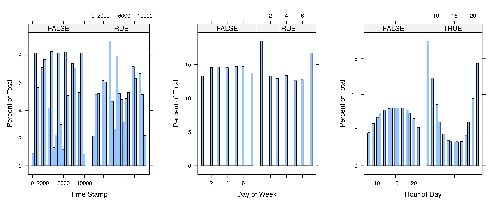

```{r setup, include=FALSE}
#source("../src/descriptive.R")
```


## Introduction

The wearable device has emerged as an important means of assessing human behaviors and served to define outcome measures in health observational and experimental studies. However, instances such as non-wearing of the device or partial wear can lead to an underestimation of total activity. Moreover, there might be potential disparities in activity levels between individuals with complete and incomplete or even no data, thereby rendering the estimated summary statistics from complete days susceptible to selection bias. This study focuses on the measurement of sedentary time during the day (8am–10pm).

This research aims to address this challenge by pioneering and assessing various imputation methods for the missing time series data to mitigate underreporting bias, a crucial factor influencing the quality of wearable tracking data. This effort not only carries immediate relevance for ongoing investigations but also offers enduring value for future researchers to contemplate, extending beyond the confines of the present analysis result.

## Data and Methods

### Data
We use data from the Physical Activity and Transit Survey (PAT). The survey asked adults in residential households in New York about their physical activity at work, home, commuting, and recreation. Among the 3811 respondents, 679 of them consented to wear accelerometer devices during all waking hours for one week. We created a concatenated dataset consisting of self-reported surveys and minute-level accelerometer data. The daytime raw accelerometer data has 3,992,520 observations, and the missing rate is about 20%.

### Methods
We have two types of key measures to impute in the accelerometer data: 1) raw activity count; As an alternative, we also impute 2) a binary indicator of whether the missing minute is a sedentary minute, defined when the activity count falls between 0 and 99. There are several similar studies in the previous literature attempting to tackle the missing data problem in the time series accelerometry data. Two common methods are linear interpolation and zero-inflated Poisson models (R package ‘accelmissing’) (Lee et al, 2019).

In this research, we first analyze the relationship between missingness and minute-level variables and survey variables. Then, starts with logical imputation and is followed by stochastic imputation based on two different methods:  1) Multilevel regression for imputation using the ‘mice’ package,  given the multilevel data structure, time points nested into individuals, we can impute the binary indicator for a sedentary minute; 2) Long Short Term Memory Neural Network. One advantage of using the deep learning method is that it does not require feature selections allowing us to directly feed all available data to the model. For instance, times series forecasting for finance with this method (Chen et al., 2016; Borovykh et al. 2017).

Once we have the completed imputation using the four methods mentioned above, we will split the data into 75% and 25% train-test datasets, and evaluate the prediction accuracy. This study answers the following research questions:

1. How does the imputation result in different key estimates compared to the complete cases method?

2. How do the accelerometry-based estimates compare to the self-reports in the survey?

3. How do different modeling approaches perform?

4. Does imputing activity count and determining sedentary status, as opposed to imputing sedentary status, enhance the accuracy and reliability of activity data imputation.

### Computational challenge
Sensory digital traces are a new type of big data with a complex structure and relatively large size (approx. 1 GB). Multilevel regression can be challenging due to the nonconvergence because there are about 6,310 minute-level observations per participant and 678 participants. The computational intensity of these methods will be a focal point of our resource planning and execution strategy.

## Results

### Descriptive Analysis of Missing Data

Each participant has 5,880 minute observations (14 hours per day for 7 days). Of the 679 participants with accelerameter data, 678 participants have missing minute observations. The following figure shows the distribution of missing minute observations. On average, each participant has 1,153 missing minute observations (indicated by the red dashed line). In total, 781,940 minute observations are missing. It is computationally challenging to impute missing minute observations.

```{r echo=FALSE, out.width="50%", fig.align="center"}
knitr::include_graphics("../results/figures/missing_min_pp.png")
```

The measurement of interest is the daytime sedentary minutes. Besides the measure derived from the accelerameter data, a survey question asks about the minutes of sedentary activity on an average day. The following figure shows the densities of two variables measuring the daytime sedentary minutes on a day. Point estimates of average sedentary minutes converge between the two measures but the variance of the self-reported survey variable is greater than the variance of the accelerameter variable. It suggests that participants may under/over report sedentary activities due to recall bias. As accelerameter sensors collect more accurate data, it may be tempting to obtain complete acceleramter data.

```{r echo=FALSE, warning=FALSE, out.width="50%", fig.align="center"}
knitr::include_graphics("../results/figures/sed_min_density_observed.png")
```

### Complete Case Approach

Complete cases approach is a straightforward method for handling missing data, which analyze only those observations for which there are no missing values in any of the variables of interest. We calculate the total sedetary minutes based on complete case, as reference to the estimates we obtain in the below using imputation approach. The result shows the an average individual had 2,894 minutes of day-time sedentary time in a week.

### Linear Interpolation

Linear interpolation is a method of estimating values between two known values in a dataset. It assumes a linear relationship between the known values, and it calculates intermediate values based on this assumption. We found the average day time sedentary minutes based on linear interpolation is X, with a variance of X.

### Single Imputation

#### Stockastic Regression Imputation

It is a method for estimating missing values in a dataset by modeling the relationship between the variable with missing data and other variables in the dataset. The target variable is the missing minute-level activity count. The main predictor is the lagged minute, which is the last activity count value observed before the missing time point. This takes into account the time series feature of the data. Other baseline variables including age, gender, activity limitation, BMI, and position of hour in a day are included in the model as covariates. They are the results of backward selection.

The activity count is based on the three-axes acceleration detects by wearable device, and therefore it is not a result of independent counting process. Instead, we treat this as continuous variables. To stabilize the variables, we took cube root of the count and lagged count variables. After the prediction, we back-transformed them to the original scale.

It is worth noting that we have considered data points are nested by each respondent, and fit a multilevel regression models with random intercept. It was successful on a small subset of data. However, when applying to the full data, it took very long time to run becasue of the large size of the data and model complexity. Therefore, this part is not presented here.

Apply the model on the train set shows root mean square error to be X, it is acceptable given the range of values. R-squared being X indicated the model explains about x% of the variability. We then generate the prediction for the missing values in full dataset. After having complete data on activity count, we determined whether each minute is a sedentary minutes based on the same criteria. We found the average day time sedentary minutes is X, with a variance of X.


### Multiple Imputation

We use multiple imputation to fill the missing minute observations given the relationship between the activity count/binary indicator of sedentary status and three fully-observed minute-level variables (timestamp, day of week, and hour of day). In the following figures, the TRUE side indicates the distribution of participants with missing minute observations. We find that the missingness is not equally distributed across different values of the timestamp, day of week, and hour of day. Specifically, missingness is more likely to happen in the morning and evening, as well as on Saturday and Sunday.

```{r echo=FALSE, fig.width=12, fig.height=4, fig.align="center"}

```

We obtain five datasets with imputed activity counts and five datasets with imputed binary sedentary status. To improve the computational efficiency, five cores are used to generate the imputed datasets in parallel. Predictive mean matching is used to impute the activity count and logistic regression is used to impute the binary indicator of sedentary status.

```{r echo=FALSE, warning=FALSE, out.width="50%", fig.align="center"}
knitr::include_graphics("../results/figures/sed_min_density_imputed.png")
```


### XGBoost Tree

### Comparison of Estimates from Different Appraoches

## Discussion

## Author Contribution Statement

Deji Suolang is responsible for ...
Kaidar Nurumov is responsible for ...
Yongchao Ma is responsible for descriptive analysis, compilation of the final report, and maintenance of the GitHub repository.


