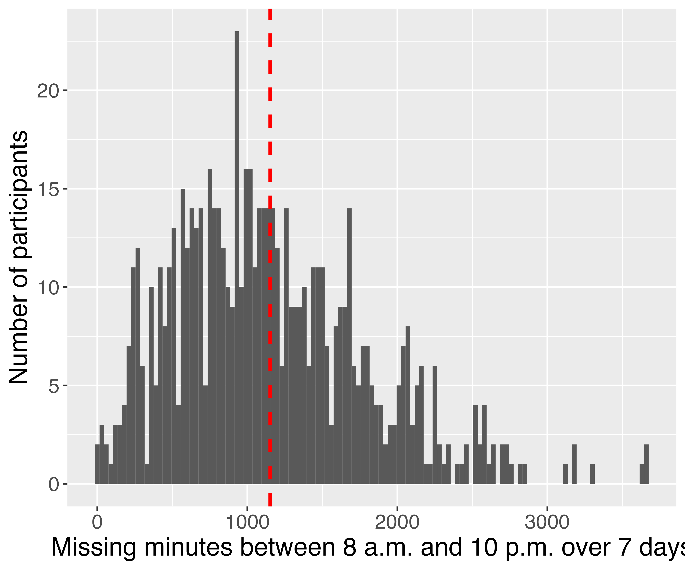

## Introduction

The wearable device has emerged as an important mean of assessing human behaviors and served to define outcome measures in health observational and experimental studies. However, instances such as non-wearing of the device or partial wear can lead to an underestimation of total activity. Moreover, there might be potential disparities in activity levels between individuals with complete and incomplete or even no data, thereby rendering the estimated summary statistics from complete days susceptible to selection bias. This study focuses on the measurement of sedentary time during the day (8am–10pm).

This research aims to address this challenge by pioneering and assessing various imputation methods for the missing time series data to mitigate underreporting bias, a crucial factor influencing the quality of wearable tracking data. This effort not only carries immediate relevance for ongoing investigations but also offers enduring value for future researchers to contemplate, extending beyond the confines of the present analysis result.


## Data and Methods

### Data
We use data from the Physical Activity and Transit Survey (PAT). The survey asked adults in residential households in New York about their physical activity at work, home, commuting, and recreation. Among the 3811 respondents, 679 of them consented to wear accelerometer devices during all waking hours for one week, and had valid data (>4 days, >10 hrs per day). We created a concatenated dataset consisting of self-reported surveys and minute-level accelerometer data. The daytime raw accelerometer data has 3,992,520 observations, and the missing rate is about 20%.


### Methods

As the key estimate of interest is a sedentary minute in a week, the target variable in the imputation can be obtained in two different ways: 1) imputing the missing activity count, and then using the thresholds in the literature to define whether a minute is sedentary. We use the Freedson (1998) cut-off point of [0-100) count-per-minute to define sedentary minutes in the accelerometer data. 2) As an alternative, we can directly impute a binary indicator of whether the missing minute is a sedentary minute. There are several similar studies in the previous literature attempting to tackle the missing data problem in the time series accelerometry data. Three common methods are linear interpolation, zero-inflated Poisson models, and ARIMA models (R packages: ‘accelmissing’, ‘imputeTS’) (Lee et al, 2019; Moritz &  Bartz-Beielstein, 2017).

In this research, we first analyze the relationship between missingness and minute-level variables, as well as missingness and survey variables reflecting individual’s characteristics. Then, starts with logical imputation and is followed by stochastic imputation based on four different methods: 1) Multiple imputations for imputing minute-level missing activity count, using time-varying variables and survey variables as predictors; 2) Multiple imputations for imputing the binary indicator for a sedentary minute; 3) Long Short Term Memory Neural Network. The LSTM is particularly suitable for long sequence data including time series. Some examples of using LSTM, include times series forecasting for finance (Chen et al., 2016; Borovykh et al. 2017). 4) Alternatively it is possible to treat the activity data as cross-sectional and use the XGboost machine learning method to impute both activity count and sedentary behavior. For the imputation with machine learning, we will split the data into 70% and 30% train-test datasets using the complete data and evaluate the overall prediction accuracy. In addition, we produce the results based on the complete case approach and linear interpolation to compare against the methods we developed. All materials to reproduce this research are available on [GitHub](https://github.com/terrymyc/BIOSTAT625-Project/tree/main).

This study answers the following research questions:

1. How does the imputation result in different key estimates compared to the complete cases method?

2. How do the accelerometry-based estimates compare to the self-reports in the survey?

3. How do different modeling approaches perform?

4. Does imputing activity count and determining sedentary status, as opposed to imputing sedentary status, enhance the accuracy and reliability of activity data imputation?


### Computational challenge

Sensory digital traces are a new type of big data with a complex structure and large size. Modeling the minute level can be challenging due to the non-convergence because there are about 5,880 minute-level observations per participant and the data from 679 participants resulted in about 4 million minute-level records. The computational intensity of these methods will be a focal point of our resource planning and execution strategy. Where possible we used a random, stratified sample of observations to initially test the model performance. Where necessary, we conducted a code optimization for the parallel running. The analyses are submitted as a slurm job on the Great Lakes High-Performance Computer, which provides us the memory and storage capability beyond our local machine.

## Results

### Descriptive Analysis of Missing Data

Each participant has 5,880 minute observations (14 hours per day for 7 days). Of the 679 participants with accelerometer data, 679 participants have missing minute observations. The following figure on the left shows the distribution of missing minute observations. On average, each participant has 1,153 missing minute observations (indicated by the red dashed line). In total, 781,940 minute observations are missing. It is computationally challenging to impute missing minute observations.

The measurement of interest is the daytime sedentary minutes. Besides the measure derived from the accelerometer data, a survey question asks about the minutes of sedentary activity on an average day. The following figure on the right shows the densities of two variables measuring the daytime sedentary minutes on a day. Point estimates of average sedentary minutes converge between the two measures but the variance of the self-reported survey variable is greater than the variance of the accelerometer variable. It suggests that participants may under/over-report sedentary activities due to recall bias. As accelerometer sensors collect more accurate data, it may be tempting to obtain complete accelerometer data.

```{r echo=FALSE, out.width="50%"}

knitr::include_graphics("../results/figures/sed_min_density_observed.png")
```

### Complete Case Approach

The complete cases approach is a straightforward method for handling missing data, which analyzes only those observations for which there are no missing values. We obtained an average of 2,894 minutes (SE 570.89) of daytime sedentary time in a week. 


### Linear Interpolation

Linear interpolation is a method of estimating values between two known values in a dataset. It assumes a linear relationship between the known values, and it calculates intermediate values based on this assumption. We found the average daytime sedentary minutes based on linear interpolation is 2,991 minutes (SE 574.16).

### Multiple Imputation

#### Impute activity count using minute-level and individual level variables

We first conducted the multiple imputation for minute-level activity count. To stabilize the variable, we used the square root transformation and back-transformed after the imputation. We defined the target variable activity count as a non-negative continuous variable. The imputation involved 10 iterations and generated m=5 datasets. Multiple imputations capture the variability between imputations.

The predictors in the imputation model include 1) Time-varying variable lagged activity count (square-root transformed), which is the last activity count observed before the one at the missing time point; 2) Hour’s position in the day; 3)Individual-level characteristics such as age, gender, race, activity limitation, income/poverty ratio, BMI range. They are the variables proven to be relevant to the sedentary behavior in the literature, and a result of backward covariate selection and variable importance test from the XGboost Tree in the below.


```{r echo=FALSE, warning=FALSE, out.width="50%", fig.align="center"}

```


The observed activity count has a mean of 335, while the mean of the imputed value is 581. The imputation is based on the full data. However, given there are millions of data points, we randomly sampled 10% of them for the diagnostic plot visualizing the observed vs. imputed values diagnostic plot. We observed their distributions are similar.

After we had the complete dataset of 5, we pooled the estimate by taking the average activity count from 5 datasets for each individual. Similar to what we have done earlier, we then use the activity count threshold to determine whether a minute is a sedentary minute. Multiply imputing approach activity count provided us with a mean of 3,234 minutes (SE 591.09) of sedentary minutes in a week.


#### Impute activity count and binary sedentary status using minute-level variables

We use multiple imputation to fill the missing minute observations given the relationship between the activity count/binary indicator of sedentary status and three fully-observed minute-level variables (timestamp, day of week, and hour of day). We find that the missingness is not equally distributed across different values of the timestamp, day of week, and hour of day. Specifically, missingness is more likely to happen in the morning and evening, as well as on Saturday and Sunday.

We obtain five datasets with imputed activity counts and five datasets with imputed binary sedentary status. To improve the computational efficiency, five cores are used to generate the imputed datasets in parallel. Predictive mean matching is used to impute the activity count and logistic regression is used to impute the binary indicator of sedentary status. The following figure shows that the distribution of sedentary minutes derived from the imputed activity counts and binary indicators of sedentary status are similar to each other.

```{r echo=FALSE, warning=FALSE, out.width="50%", fig.align="center"}

```


### XGBoost Tree

In addition to multiple imputation we use a machine learning approach where joined accelerometer and survey data are used as covariates to impute activity count/binary indicator. Unlike the previous models, we use complete case data to train and test our models and then fill in missing values based on the best-performing model. To train our model we use XGBoost, an efficient regularized boosting algorithm that uses a sequential ensemble of trees to improve model performance. The algorithm can be used with binary, categorical as well as continuous variables. The complete data are split into train (70%) and test (30%) datasets. Overall, to train the model we selected 60 complete case covariates (features) available for the datasets with missing and non-missing target variables. The model was trained using 5-fold cross-validation and the grid of hyperparameters specific to XGBoost with the subsequent selection of the best model based on the overall accuracy. The final model was used to predict the continuous count and binary activity for the test as well as the data with missing sed_min status. For the test dataset, we evaluated the model performance using balanced accuracy (binary_count) and R-squared (count data) sensitivity, and specificity calculated based on the confusion matrix of predicted and observed sedentary behavior cases. Note that for this classification task, we ignored the time-series nature of accelerometer data and treated sed_min and count as cross-sectional indicators. 

The results show that training the model for count data produced relatively low R-square (0.11) whereas for the binary data, the overall accuracy was 0.63 with high sensitivity and relatively low specificity.


### Autoregressive Integrated Moving Average and Kalman Smoothing

While the machine learning approach provided a convenient way of filling NAs using ensemble training we did not account for the time series nature of accelerometer count activity data. In this subsection, we use the ARIMA model for the univariate time series count together with Kalman smoothing (KS). While the ARIMA model uses a lagged moving average, KS can account for noisy measurement by incorporating information from past and future observations and hence improve the imputation of time-series data. Noteworthy, for a sequence of missing values using the transition equation KS can make a best guess without the data, hence the imputed NAs can take any value including the negative. For our imputed data, we replaced all negative imputations with zeros. The results show that the mean value of count activity after the imputation is 323 whereas the mean value of complete data is 335. 

### Comparison of Estimates from Different Appraoches

The complete case approach deleted all missing values and therefore at the risk of underestimation. Among the imputation results, we found that linear interpolation produced the smallest estimate and standard error. As interpolation uses the mean value before and after the missing time point, a smaller variation is expected. With multiple imputation approaches, imputing binary indicators produced smaller estimates and smaller standard errors. We observed correlations between two multiple imputation methods are high.

We found the accelerometer-based estimate and self-reports have low correlations around 0.2. It is not surprising as such weak correlations are repeatedly confirmed by the literature. We conclude these two measures have different properties.

```{r echo=FALSE, warning=FALSE, out.width="50%", fig.align="center"}
knitr::include_graphics("../results/figures/corrplot.png")
```

The takeaways from this study: 1) Understanding missing patterns is the most critical first step; 2) As there is no any widely-accepted statistical distribution for such accelerometer-based activity count, predicting binary activity status instead of raw count might be a more reliable option; 3) To fully understand the imputation of time-series accelerometer data further research is needed. 4) 


## Discussion

This study added additional methods to the existing literature for handling missing data in the time series accelerometer data. We demonstrated the estimates based on different methods and provided recommendations for future research.  The activity count as a proxy of acceleration wearable device detects is not a counting process of the random independent events, therefore Poisson or negative binomial distributions that usually apply to count data do not apply in this case. We treated it as a continuous variable, but this is under debate. The lack of predictive power may be due to the lack of suitable distribution for such data. In addition, there are several limitations: (1) Due to not meaningful training results we did not use the LSTM model (2) We did not use multilevel models for the imputation, due to low, but significant random variance as well as convergence issues for the full sample. (3) Since we used different imputation approaches our imputation models are not always directly comparable. Future research can build on these limitations and further investigate ways to efficiently impute accelerometer data. 


## Author Contribution Statement

Deji Suolang is responsible for multiple imputations, Kaidar Nurumov is responsible for ...
Yongchao Ma is responsible for descriptive analysis, a compilation of the final report, and maintenance of the GitHub repository.
All team members contributed to the study design, data management, and report writing.


